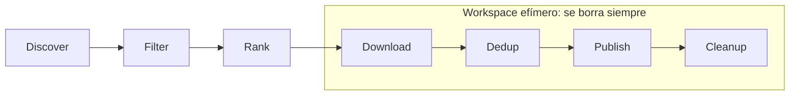
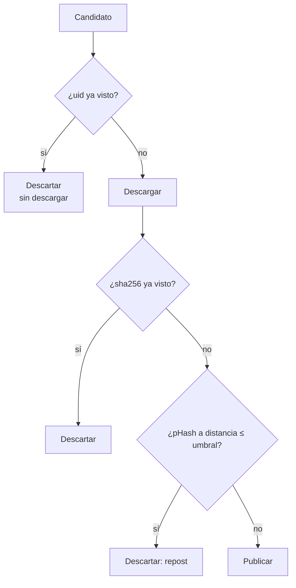

# Arquitectura

Este documento explica cómo encaja Scrappy por dentro y, sobre todo, **por qué** está montado así. Para las decisiones puntuales con alternativas descartadas, mira los [ADRs](adr/).

---

## La idea en una frase

Scrappy es un **pipeline de seis etapas** en el que las cuatro últimas se ejecutan **por item, no por lote**, de modo que en cualquier instante hay como mucho un medio materializado en la máquina.



Esa estructura no es casual. La alternativa obvia —descargarlo todo y publicarlo después— sería un poco más rápida pero significaría tener cinco videos en el disco simultáneamente, y eso choca de frente con la restricción central del proyecto. Ver [EPHEMERAL_STORAGE.md](EPHEMERAL_STORAGE.md).

---

## Capas

```
                 ┌──────────────────────────────┐
   entrada       │ cli.py  bot/  tui/  scheduler/│   Interfaces
                 └──────────────┬───────────────┘
                                │
                 ┌──────────────▼───────────────┐
   coordinación  │   app.py  (composition root) │    Monta y apaga todo
                 │   core/pipeline.py           │    Orquesta las 6 etapas
                 └──────────────┬───────────────┘
                                │
      ┌──────────┬──────────┬───┴──────┬──────────┬──────────┐
      ▼          ▼          ▼          ▼          ▼          ▼
   sources/   ranking/   download/  storage/  delivery/  observability/
   ¿qué hay?  ¿qué vale? ¿cómo lo   ¿ya lo    ¿cómo se   logs
                         traigo?    vi?       publica?
```

**Regla que sostiene el diseño:** nada crea sus propias dependencias. Todo se construye en `app.py` y se inyecta. Por eso el pipeline se puede probar entero con dobles de prueba sin tocar la red ni Telegram, que es exactamente lo que hace `tests/integration/test_pipeline.py`.

---

## Recorrido de un meme

Seguimos un post concreto desde que existe hasta que desaparece de la máquina.

### 1. Discover — `sources/`

Cada adapter implementa una interfaz mínima:

```python
class SourceAdapter(abc.ABC):
    name: str
    requires_tos_ack: bool

    async def status(self) -> SourceStatus: ...
    async def discover(self, budget: int) -> list[RawCandidate]: ...
```

Un adapter **solo descubre**. No descarga, no filtra, no puntúa, no publica. Esa restricción es lo que hace que añadir una plataforma sea un fichero nuevo y no un refactor ([SOURCES.md](SOURCES.md)).

Todas las fuentes se consultan **en paralelo** (`asyncio.gather` con `return_exceptions=True`): que TikTok se caiga no puede impedir que Reddit publique.

El resultado son `RawCandidate`: metadatos normalizados, **sin descargar ni un byte**.

### 2. Filter — `ranking/filters.py`

Reglas duras sobre metadatos: NSFW, antigüedad, duración, palabras y autores vetados, idioma.

Aquí se decide si un item es **aceptable**, no si es **bueno**. Un video de tres horas no es un video corto mediocre: sencillamente no es lo que este bot publica.

Cada rechazo aquí ahorra una descarga entera, que es el paso caro.

### 3. Rank — `ranking/scorer.py`

Convierte cada candidato en un `ScoredCandidate` con su nota y el desglose de cómo se calculó. La fórmula y cómo calibrarla están en [RANKING.md](RANKING.md).

### 4-7. Download → Dedup → Publish → Cleanup

Aquí está el corazón del diseño:

```python
for scored in seleccionados:
    with EphemeralWorkspace(root) as workspace:   # ← el borrado vive aquí
        media = await downloader.fetch(candidate, workspace.path)
        media = await dedup.compute_hashes(media)
        await dedup.assert_not_duplicate(media)
        item  = await publisher.publish(scored, media)
    # aquí el medio YA NO EXISTE
    await state.record(item)                      # solo metadatos
```

Cualquier salida del bloque —retorno normal, excepción, `CancelledError`— pasa por el `__exit__` del workspace. **No hay ninguna ruta de código que se salte el borrado.**

Fíjate en el orden: `state.record(item)` está *fuera* del `with`. Lo que se persiste se persiste cuando el medio ya se ha borrado, no antes.

---

## Las cuatro representaciones de un item

Cada una conoce solo lo que se ha averiguado hasta ese punto del pipeline:

| Modelo | Qué es | ¿Toca bytes? | ¿Se persiste? |
|---|---|:---:|:---:|
| `RawCandidate` | Metadatos de la plataforma | no | no |
| `ScoredCandidate` | + nota y desglose | no | no |
| `EphemeralMedia` | El medio, en RAM o en fichero temporal | **sí** | **nunca** |
| `PublishedItem` | Hashes, ids y `file_id` de Telegram | no | sí (~200 B) |

`EphemeralMedia` es deliberadamente la **única** clase que toca bytes y deliberadamente la **única** que no se serializa jamás. Esas dos propiedades juntas son la garantía del proyecto expresada en el sistema de tipos.

---

## Deduplicación: tres puertas

Un mismo meme llega recomprimido y recortado desde tres sitios distintos. Compararlo por URL no sirve de nada.



El orden va de barato a caro a propósito. La primera puerta cuesta una consulta y ahorra la descarga entera. La tercera es la única costosa, y aun así se limita a los hashes de los últimos 90 días: un repost de hace un año ya no molesta a nadie.

Para video, el pHash se calcula sobre **tres frames** muestreados al 25 %, 50 % y 75 % de la duración —se evitan el principio y el final porque muchos clips empiezan o acaban en negro— y se concatenan. Los frames se extraen por stdout con `-f image2pipe`, así que ni siquiera el frame llega a ser un fichero.

---

## Manejo de errores

La jerarquía de `core/errors.py` codifica una distinción operativa:

| Tipo | Alcance | Qué hace el pipeline |
|---|---|---|
| `ConfigError` | Arranque | Aborta con un mensaje accionable |
| `SourceError` | Una fuente | La omite esta ronda, sigue con las demás |
| `RateLimitedError` | Una fuente | Igual, y anota que hay que esperar |
| `ItemError` | Un item | Lo anota y pasa al siguiente |
| `DuplicateItemError` | Un item | No es un fallo: es el sistema funcionando |

Un video roto no puede tumbar un run. Credenciales inválidas sí deben parar esa fuente de inmediato: reintentar subreddit por subreddit con un token muerto es una ristra de peticiones condenadas y un camino rápido al rate limit.

---

## Concurrencia

- **Descubrimiento: paralelo.** Son peticiones HTTP independientes.
- **Descarga y publicación: secuencial.** Por la restricción de disco y porque Telegram limita a ~20 mensajes/minuto por chat de todos modos.
- **Trabajo bloqueante en hilos.** yt-dlp, ffmpeg y el hashing son síncronos; van a `asyncio.to_thread` para no congelar el bucle de eventos que atiende los comandos del bot.
- **`max_instances=1` en el scheduler.** Si un run tarda más que el intervalo, no se lanza otro encima. Dos pipelines simultáneos competirían por el rate limit y publicarían duplicados.

---

## Qué persiste y qué no

Solo hay un fichero persistente y contiene únicamente metadatos:

```sql
CREATE TABLE published (
    uid, source, source_id, permalink,
    sha256, phash, score, kind,
    telegram_message_id, telegram_file_id,
    published_at
);
```

Unos 200 bytes por item: publicando 5 memes cada 3 horas son ~3 MB al año. Se puede desactivar del todo con `SCRAPPY_STATE_BACKEND=memory` o `=none`, a cambio de que el bot repita contenido.

El `telegram_file_id` es lo que convierte a Telegram en el archivo real: con él se puede reenviar un medio a otro chat sin volver a descargarlo de la plataforma original.

---

## Dónde tocar según qué quieras cambiar

| Quiero… | Fichero |
|---|---|
| Añadir una plataforma | `sources/` + una línea en `registry.py` → [SOURCES.md](SOURCES.md) |
| Cambiar la interfaz de terminal | `tui/` → [TUI.md](TUI.md) |
| Cambiar qué se considera "lo mejor" | `config/sources.yaml` → [RANKING.md](RANKING.md) |
| Cambiar cómo se ve un post en Telegram | `delivery/captions.py` |
| Añadir un comando al bot | `bot/handlers.py` |
| Cambiar los límites de tamaño o calidad | `download/transcode.py` |
| Cambiar el criterio de duplicado | `storage/dedup.py` |
